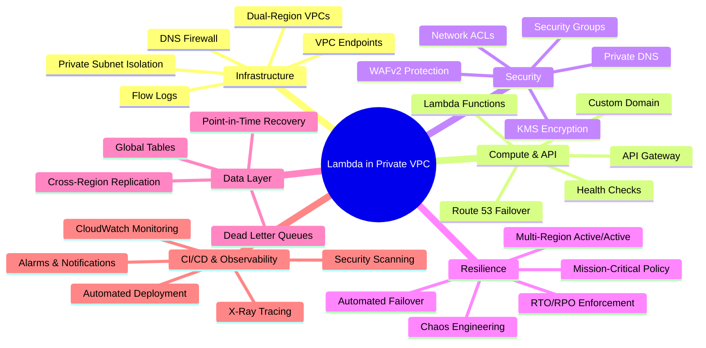
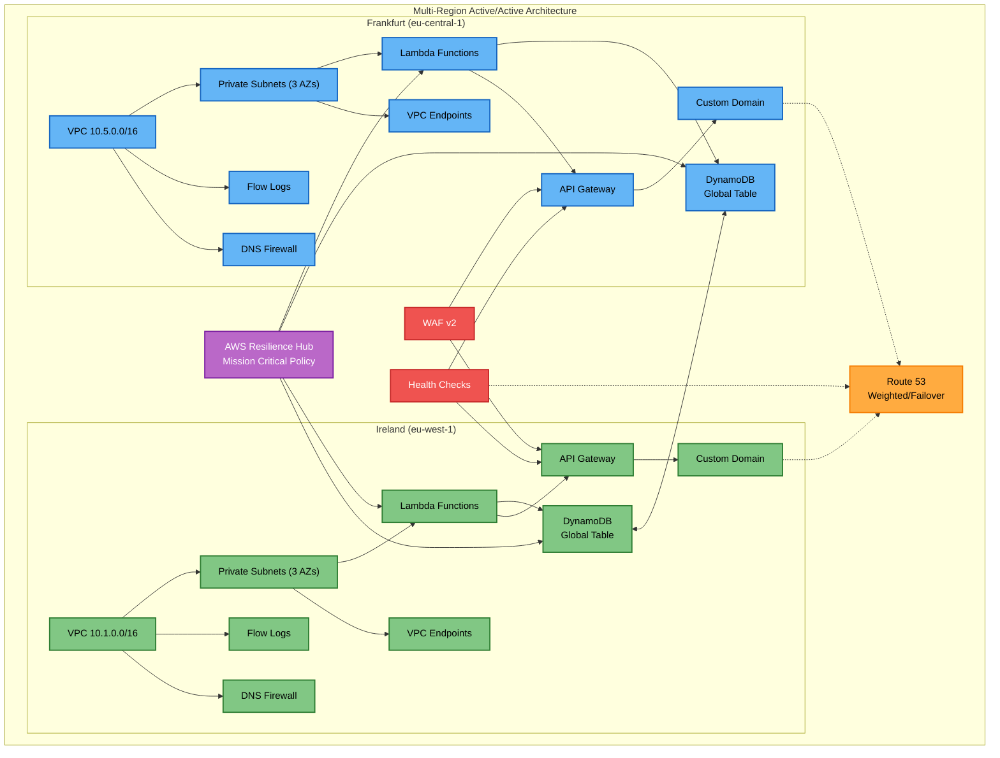
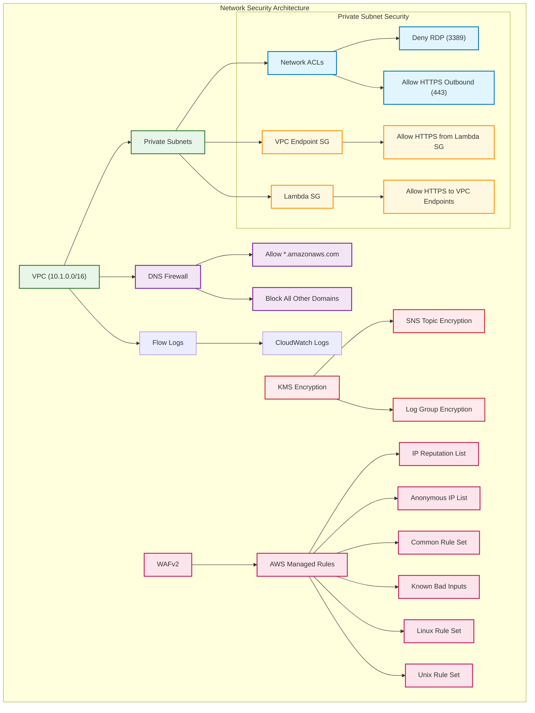
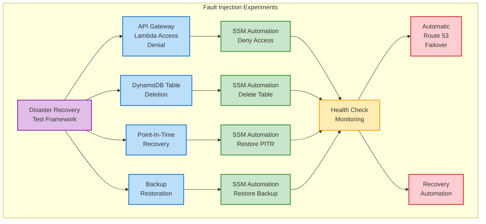
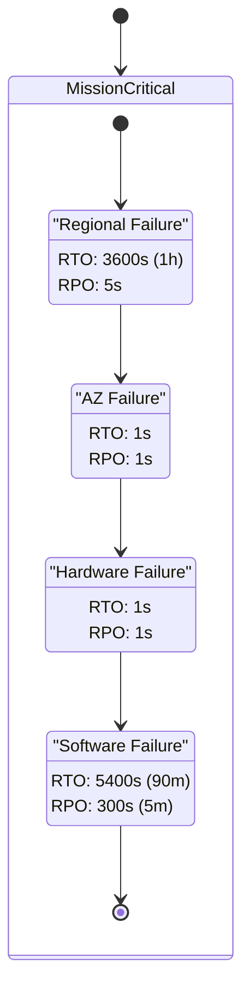
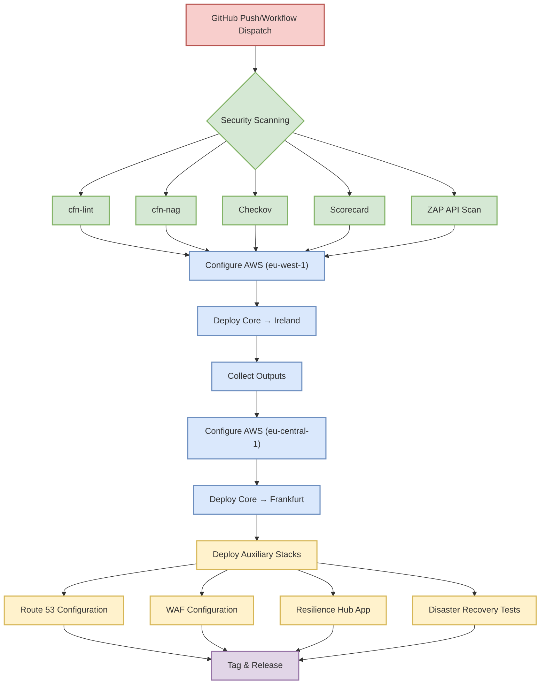

# 🚀 Lambda in Private VPC

  
  
  

> **Enterprise-grade multi-region active/active architecture** with near-zero recovery time, comprehensive DNS failover, and AWS Resilience Hub policy compliance for mission-critical applications.

## 📋 Table of Contents

- [📑 Project Overview](#-project-overview)
- [🏗️ Architecture](#️-architecture)
- [🔐 Network & Security](#-network--security)
- [🧪 Resilience Testing](#-resilience-testing)
- [⏱️ Recovery Objectives](#️-recovery-objectives)
- [🔄 CI/CD Pipeline](#-cicd-pipeline)
- [📦 Infrastructure as Code](#-infrastructure-as-code)
- [📚 Documentation](#-documentation)
- [📄 License](#-license)

## 📑 Project Overview

This project implements a highly resilient serverless architecture with AWS Lambda functions deployed in private VPCs across multiple AWS regions (Ireland and Frankfurt). It features comprehensive security controls, automated failover mechanisms, and stringent disaster recovery capabilities through AWS Resilience Hub policy enforcement.

## 🏗️ Architecture

A true active/active multi-region architecture with isolated private subnets, global data replication, and automated failover systems.

### Key Components

- **Isolated Private VPCs**: Dedicated VPCs in each region with no internet access
- **Multi-AZ Deployment**: 3 private subnets across availability zones for high availability
- **Private Network Controls**: Security groups, NACLs, and flow logs for comprehensive protection
- **Global Data Layer**: DynamoDB global tables with automatic multi-region replication
- **Intelligent Routing**: Route 53 health checks and weighted routing with automatic failover
- **API Gateway**: Regional endpoints with custom domain names and WAF protection

## 🔐 Network & Security

### Security Features

- **Private VPC Design**: No internet gateways, isolated subnets
- **DNS Firewall**: Allows only AWS domains, blocks all other outbound DNS queries
- **Network ACLs**: Customized ingress/egress rules with RDP blocking
- **Security Groups**: Least-privilege access between Lambda and VPC endpoints
- **Comprehensive WAF Protection**: Six AWS managed rule groups for API security
- **VPC Flow Logs**: Network traffic visibility and auditing with encrypted logs
- **KMS Encryption**: Custom KMS keys for SNS topics and CloudWatch logs
- **IAM Least Privilege**: Detailed IAM roles and policies for all components

## 🧪 Resilience Testing

### Chaos Engineering Capabilities

- **AWS Fault Injection Service**: Predefined experiments to simulate failures
- **Lambda Access Denial**: Tests API Gateway resilience during Lambda failures
- **DynamoDB Failure Scenarios**: Table deletion and recovery testing
- **Point-in-Time Recovery**: Automated restore procedures with defined RPOs
- **Backup Restoration**: Complete data recovery from backups
- **SSM Automation Documents**: Pre-defined recovery runbooks for all scenarios

## ⏱️ Recovery Objectives

This architecture achieves stringent recovery time objectives (RTO) and recovery point objectives (RPO) through AWS Resilience Hub policy enforcement.

### Recovery Metrics

| Failure Scenario | Recovery Time Objective | Recovery Point Objective | Implementation |
|------------------|--------------------------|--------------------------|----------------|
| **Regional Failure** | 3600s (1 hour) | 5s | Multi-region active/active with Route 53 failover |
| **Availability Zone Failure** | 1s | 1s | Multi-AZ deployment in each region |
| **Hardware Failure** | 1s | 1s | AWS managed infrastructure redundancy |
| **Software Failure** | 5400s (90 min) | 300s (5 min) | Automated recovery procedures and global tables |

## 🔄 CI/CD Pipeline

### Automated Workflow

1. **Security Scanning**: Multiple tools scan CloudFormation templates for issues
2. **Sequential Deployment**: Ireland deployment, followed by Frankfurt
3. **Cross-Region Integration**: Output collection and sharing between regions
4. **Auxiliary Resources**: Route 53, WAF, Resilience Hub, and DR test configuration
5. **Automated Release**: Version tagging and release notes generation

## 📦 Infrastructure as Code

This project is entirely defined as CloudFormation templates with comprehensive resource definitions.

### Template Structure

| Template | Purpose | Key Components |
|----------|---------|----------------|
| **template.yml** | Core Infrastructure | VPCs, Subnets, Lambda, API Gateway, DynamoDB, DNS Firewall, Security Groups |
| **route53.yml** | DNS Configuration | Weighted A/AAAA records, Health check integration, Failover configuration |
| **app.yml** | Resilience Hub | Mission Critical policy definition, RTO/RPO targets, Multi-resource mapping |
| **disaster-recovery.yml** | DR Testing | FIS experiments, SSM automation documents, Recovery procedures |
| **waf.yml** | Security Rules | WAF WebACL with AWS managed rules for API protection |

### Key Resource Highlights

- **DNS Firewall**: Allows only AWS domains, blocks all others
- **Private DNS Configuration**: Secure VPC DNS settings
- **Network ACLs**: Custom ingress/egress rules
- **Health Checks**: Route 53 health checks for API endpoints
- **WAF Protection**: Six AWS managed rule groups
- **Global Tables**: Cross-region data replication
- **IAM Roles**: Least privilege principle implementation

## 📚 Documentation

### Runbooks

- **DynamoDB Recovery**: Automated systems manager runbook
- **Lambda Function Recovery**: Automated systems manager runbook
- **API Gateway Recovery**: Step-by-step recovery procedures
- **IAM Automation**: Identity and access management workflows

### References

- [AWS Resilience Hub Documentation](https://docs.aws.amazon.com/resilience-hub/latest/userguide/)
- [Disaster Recovery on AWS - Part I: Strategies for Recovery in the Cloud](https://aws.amazon.com/blogs/architecture/disaster-recovery-dr-architecture-on-aws-part-i-strategies-for-recovery-in-the-cloud/)
- [Disaster Recovery on AWS - Part IV: Multi-site Active/Active](https://aws.amazon.com/blogs/architecture/disaster-recovery-dr-architecture-on-aws-part-iv-multi-site-active-active/)
- [AWS Service Level Agreements](https://aws.amazon.com/legal/service-level-agreements/)

## 📄 License

This project is licensed under the Apache License 2.0 - see [LICENSE.md](LICENSE.md) for details.
