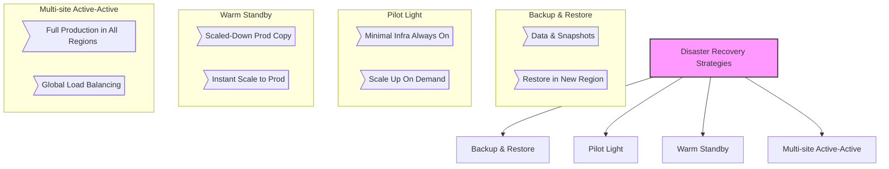
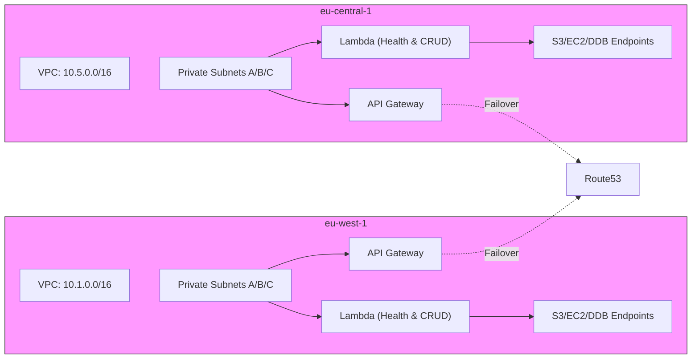
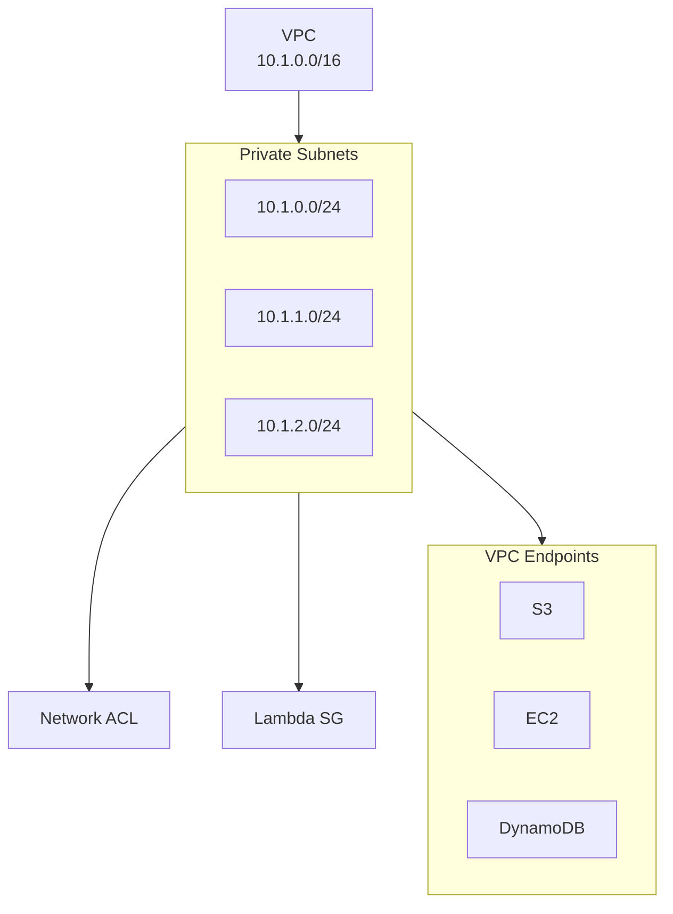
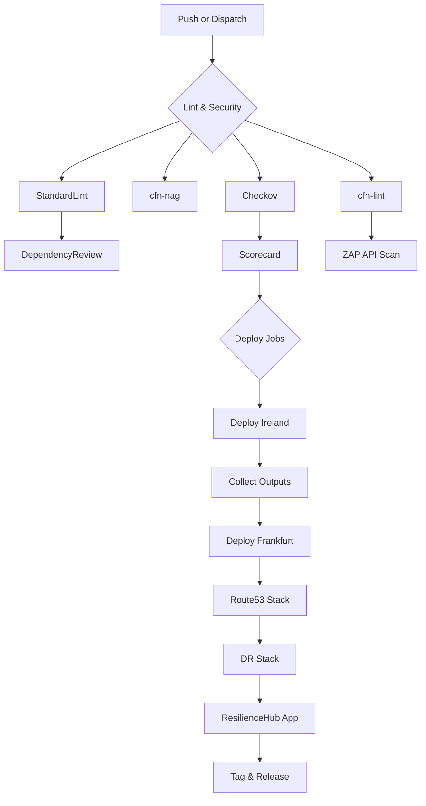
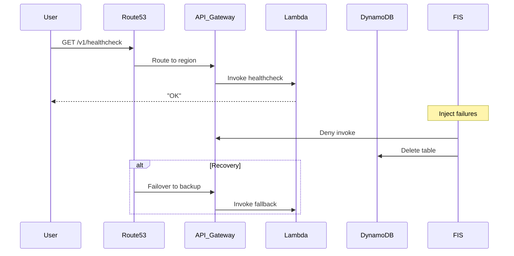
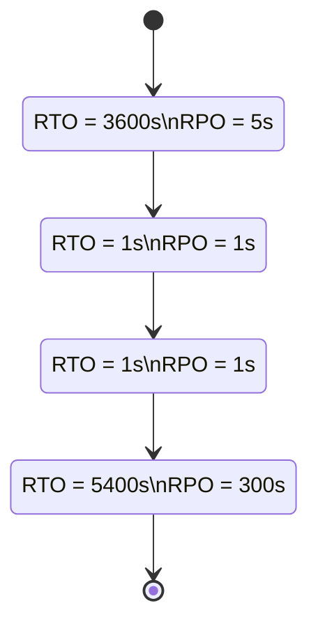

# 🚀 Lambda in Private VPC

  
[](https://securityscorecards.dev/viewer/?uri=github.com/Hack23/lambda-in-private-vpc)  
[](https://github.com/Hack23/lambda-in-private-vpc/actions/workflows/main.yml)  
[](https://github.com/Hack23/lambda-in-private-vpc/actions/workflows/scorecard.yml)

> **Description:** A highly available system spanning **Ireland** and **Frankfurt** AWS regions, enforcing RTO/RPO via AWS Resilience Hub, chaos‑tested by FIS, and fronted by API Gateway with Route 53 failover & WAF protection.

---

## 📋 Table of Contents

- [🧠 Project Mindmap](#-project-mindmap)  
- [🌐 Overview](#-overview)  
- [📐 Architecture](#-architecture)  
- [🔗 Network Topology](#-network-topology)  
- [🚦 CI/CD Workflow](#-ci-cd-workflow)  
- [🚨 Disaster Recovery Flow](#-disaster-recovery-flow)  
- [🛡️ Resilience Hub Policy](#️-resilience-hub-policy)  
- [🖼️ Screenshots](#️-screenshots)  
- [📦 Templates](#-templates)  
- [🛠️ Tech Stack](#️-tech-stack)  
- [📖 Runbooks](#-runbooks)  
- [🔗 References](#-references)  
- [📄 License](#-license)

---

## 🧠 Project Mindmap

```mermaid
mindmap
  root((Lambda in Private VPC))
    Infra((Infrastructure))
      VPC((VPC))
      Subnets((Subnets))
      Endpoints((VPC Endpoints))
      Networking((ACLs & SGs))
    Compute((Compute))
      HealthLambda((Healthcheck Lambda))
      CrudLambda((CRUD Lambda))
    API((API Layer))
      Gateway((API Gateway))
      Domain((Custom Domain))
      DNS((Route 53 Failover))
    Resilience((Resilience & DR))
      ResHub((AWS Resilience Hub))
      RTO_RPO((RTO & RPO Policies))
      HA((High Availability))
      DR((Disaster Recovery))
        DR_Strategies((Recovery Strategies))
          BackupRestore((Backup & Restore))
          PilotLight((Pilot Light))
          WarmStandby((Warm Standby))
          MultiSite((Multi-site Active-Active))
      BCP((Business Continuity Plan))
    Data((Data))
      DynamoDB((Global Table))
      DLQ((Dead‑Letter SNS))
    Security((Security))
      WAF((AWS WAFv2))
      IAM((IAM Roles & Policies))
      NetworkACL((Network ACLs))
      SecurityGroup((Security Groups))
    CI_CD((CI/CD & Scanning))
      Linting((cfn-lint))
      CNag((cfn-nag))
      Checkov((Checkov))
      ZAP((ZAP API Scan))
      Scorecard((OSSF Scorecard))
      Actions((GitHub Actions))
    Docs((Documentation))
      Runbooks((Runbooks))
      DRPlan((DR Plan))
      BCPPlan((BCP Plan))
      TechStack((Tech Stack))
  
  classDef root fill:#ffcc00,stroke:#333,stroke-width:2px;
  classDef Infra,Compute,API,Resilience,Data,Security,CI_CD,Docs fill:#00ccff,stroke:#333;
  classDef DR_Strategies,RTO_RPO,HA,DR,BCP fill:#ff6666,stroke:#333;
  classDef VPC,Subnets,Endpoints,Networking fill:#99ee99,stroke:#333;
  classDef HealthLambda,CrudLambda fill:#cc99ff,stroke:#333;
  classDef Gateway,Domain,DNS fill:#ff99cc,stroke:#333;
  classDef DynamoDB,DLQ fill:#ffcc99,stroke:#333;
  classDef WAF,IAM,NetworkACL,SecurityGroup fill:#ff9966,stroke:#333;
  classDef Linting,CNag,Checkov,ZAP,Scorecard,Actions fill:#99ccff,stroke:#333;
  classDef Runbooks,DRPlan,BCPPlan,TechStack fill:#ccccff,stroke:#333;
```

---

## 🚧 Disaster Recovery Strategies

This section outlines the four main AWS disaster recovery patterns supported by this project:



- **Backup & Restore**: Periodic backups of configuration and data; recovery time depends on restore duration.  
- **Pilot Light**: Core components running in standby; scale up non-critical services when needed.  
- **Warm Standby**: Fully functional but scaled-down duplicate environment; fast failover.  
- **Multi-site Active-Active**: Full environments in all regions; automatic global traffic distribution.

---

## 🌐 Overview

Run Lambda inside private subnets in two regions, with:

- **No public access**: VPC Endpoints for S3, EC2, DynamoDB  
- **Multi-region failover**: Route 53 weighted DNS  
- **Resiliency**: AWS Resilience Hub policies & AWS FIS chaos  
- **Layer7 Security**: AWS WAFv2 rules  
- **CI/CD**: GitHub Actions with CFN lint, cfn-nag, Checkov, ZAP, scoring, and cross‑account deploys  

---

## 📐 Architecture



---

## 🔗 Network Topology



---

## 🚦 CI/CD Workflow



---

## 🚨 Disaster Recovery Flow



---

### 🛡️ Resilience Hub Policy



---

## 🖼️ Screenshots

### Resilience Hub

  
  
  
  


### Infrastructure Diagrams

| Diagram             | Preview                                  |
|---------------------|------------------------------------------|
| Core Infra          |     |
| Route 53 DNS        |    |
| Application Firewall|            |

---

## 📦 Templates

```bash
cloudformation/
├─ template.yml           # VPC, subnets, Lambdas, API, DynamoDB
├─ route53.yml            # DNS failover records
├─ app.yml                # Resilience Hub App & Policy
├─ disaster-recovery.yml  # FIS experiments
└─ waf.yml                # WAFv2 rules
```

---

## 🛠️ Tech Stack

- **Infra as Code:** CloudFormation  
- **Serverless:** Lambda (Node.js 20.x)  
- **API:** API Gateway (Regional, Custom Domain)  
- **Storage:** DynamoDB Global Tables  
- **Networking:** VPC, Private Subnets, Endpoints, ACLs, SGs  
- **DNS:** Route 53 Weighted Failover  
- **Resiliency:** AWS Resilience Hub, FIS  
- **Security:** WAFv2, IAM Roles & Policies  
- **CI/CD:** GitHub Actions, cfn-lint, cfn-nag, Checkov, ZAP, Scorecard  

Details: [techstack.md](./techstack.md)

---

## 📖 Runbooks

- **DynamoDB** – SSM Automation for tables/indexes  
- **Lambda** – SSM Automation for functions & aliases  
- **App Runner** – Manage App Runner & domains  
- **IAM** – Automate IAM user/group/role operations  

---

## 🔗 References

- DR I: https://aws.amazon.com/blogs/architecture/disaster-recovery-dr-architecture-on-aws-part-i-strategies-for-recovery-in-the-cloud/  
- DR IV: https://aws.amazon.com/blogs/architecture/disaster-recovery-dr-architecture-on-aws-part-iv-multi-site-active-active/  
- Resilience Hub: https://docs.aws.amazon.com/resilience-hub/latest/userguide/  
- Route 53 ARC: https://aws.amazon.com/route53/application-recovery-controller/  
- DNS Firewall: https://docs.aws.amazon.com/Route53/latest/DeveloperGuide/resolver-dns-firewall.html/  
- SLA Tools: https://github.com/mikaelvesavuori/slamax | https://github.com/mikaelvesavuori/cloud-sla  

---

## 📄 License

This project is licensed under the **Apache License 2.0**. See [LICENSE.md](LICENSE.md).  
