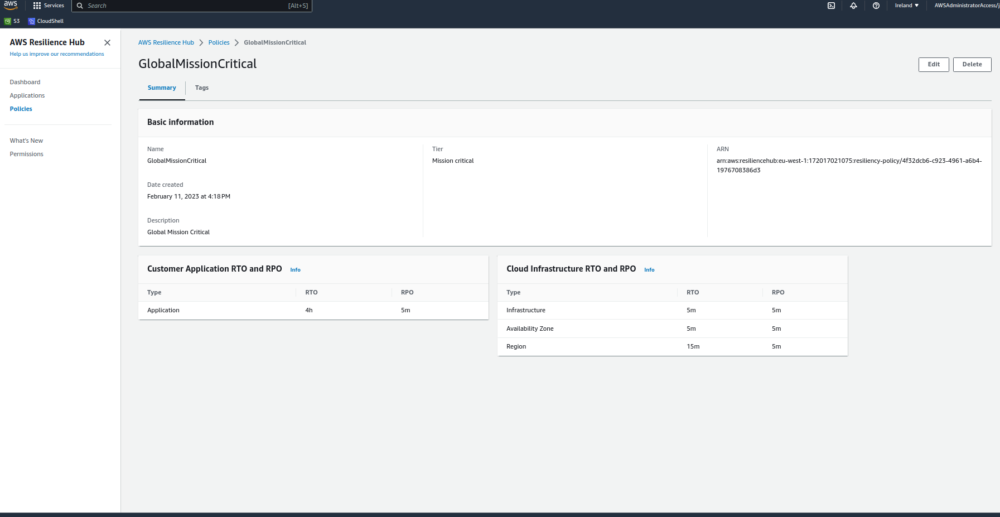
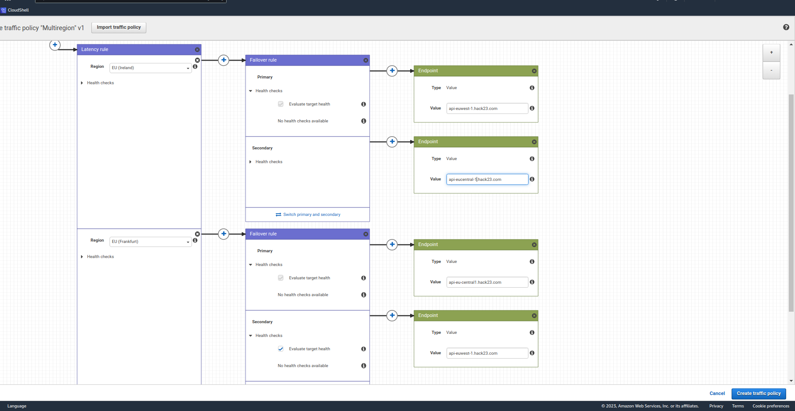
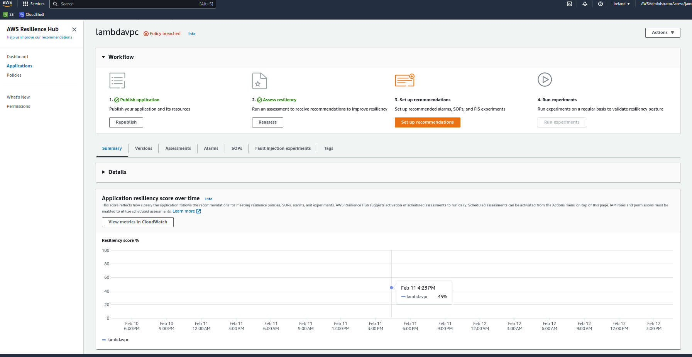
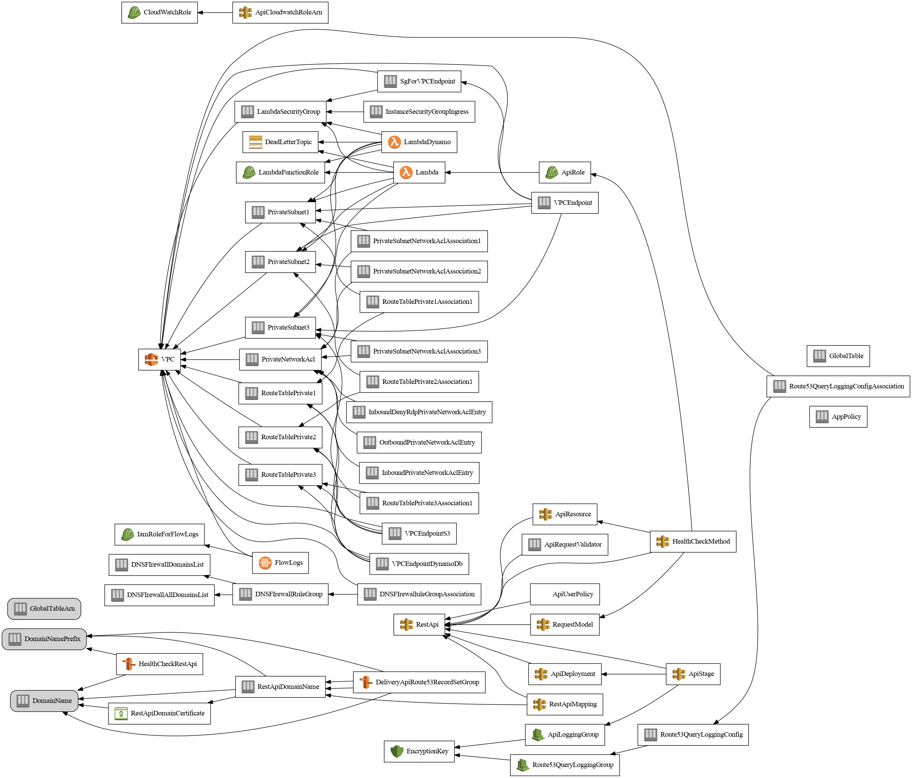
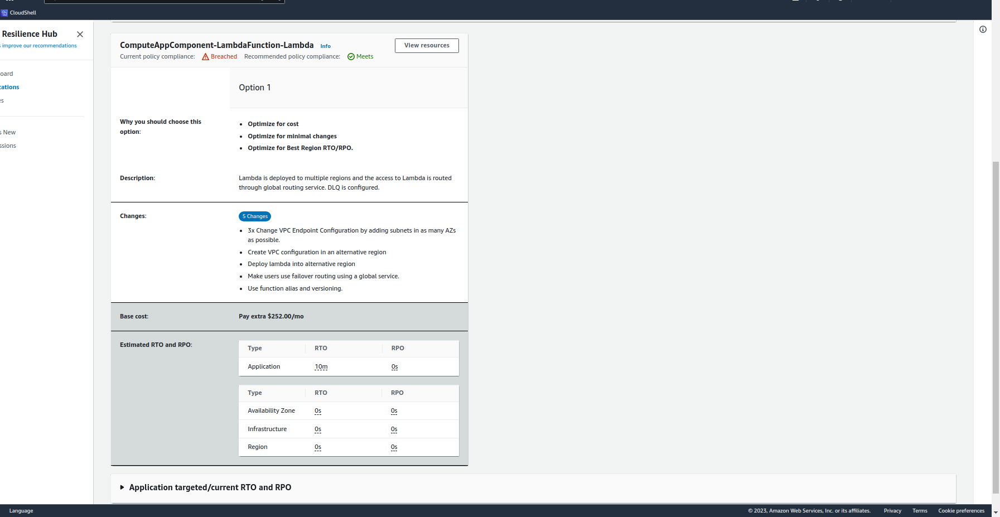
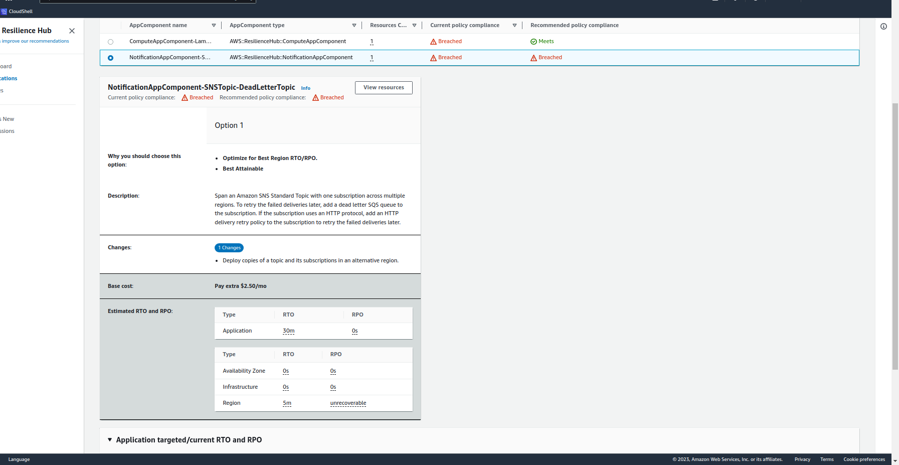

# lambda-in-private-vpc

status : WIP

POC of multi region active/active site with resilience hub policy compliance with RTO/RPO 5 Min for Application/AZ/Region failures with setup SOP and fault injections(proof of executions of SOP)
Zero trust example

Api gateway with schema request validation and cross region replicated dynamodb. Route53 geolocation  dns setup. Using https://github.com/aws-samples/amazon-cloudfront-secure-static-site with Cloudfront failover S3 bucket in different region for frontend. 

https://api.hack23.com/v1/healthcheck

Badges
/raw/master/LICENSE.md)

# Concepts

https://docs.aws.amazon.com/resilience-hub/latest/userguide/concepts-terms.html

https://aws.amazon.com/route53/application-recovery-controller/
https://docs.aws.amazon.com/Route53/latest/DeveloperGuide/resolver-dns-firewall.html

https://github.com/mikaelvesavuori/slamax / https://github.com/mikaelvesavuori/cloud-sla

Please refer to [https://aws.amazon.com/legal/service-level-agreements/](https://aws.amazon.com/legal/service-level-agreements/) for more information.

| **Service**                                                                                                                         | **Key**                                | **SLA**               |
| ----------------------------------------------------------------------------------------------------------------------------------- | -------------------------------------- | --------------------- |
| Amazon API Gateway                                                                                                                  | `amazon-api-gateway`                   | 99.95%                |
| Amazon CloudWatch (including Metrics API, Logs Data Ingestion API and Alarms)                                                       | `amazon-cloudwatch`                    | 99.9%                 |
| Amazon DynamoDB (Global Tables SLA)                                                                                                 | `amazon-dynamodb-globaltables`         | 99.999%               |
| Amazon Messaging (SQS, SNS)                                                                                                         | `amazon-messaging`                     | 99.9%                 |
| Amazon Route 53                                                                                                                     | `amazon-route53`                       | 100%                  |
| AWS Certificate Manager Private Certificate Authority                                                                               | `aws-certificate-manager-privateca`    | 99.9%                 |
| AWS Key Management Service (KMS)                                                                                                    | `aws-kms`                              | 99.999%               |
| AWS Lambda                                                                                                                          | `aws-lambda`                           | 99.95%                |
| AWS WAF                                                                                                                             | `aws-waf`                              | 99.95%                |
| AWS X-Ray                                                                                                                           | `aws-xray`                             | 99.9%                 |

SLA MAX = 0.994592393 (0.9995 * 0.999 * 0.99999 * 0.999 1* 0.999 * 0.99999 * 0.9995 * 0.9995 * 0.999)

SLO = 99.45%

SLA level of 99.45 % uptime/availability results in the following periods of allowed downtime/unavailability:

Daily: 7m 55s
Weekly: 55m 26s
Monthly: 3h 59m 4.8s
Quarterly: 11h 57m 14s
Yearly: 1d 23h 48m 58s
Direct link to the page with these results: https://uptime.is/99.45

Multi region active/active is more resilient to regional failures and dynamodb global tables (99.999%)

https://aws.amazon.com/premiumsupport/technology/pes/

