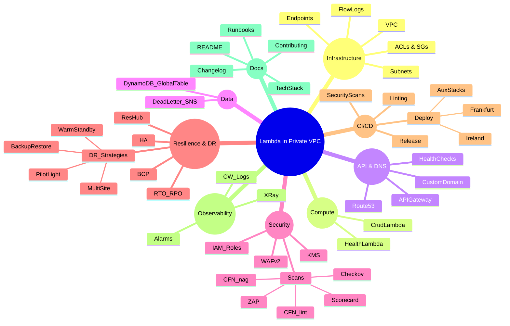
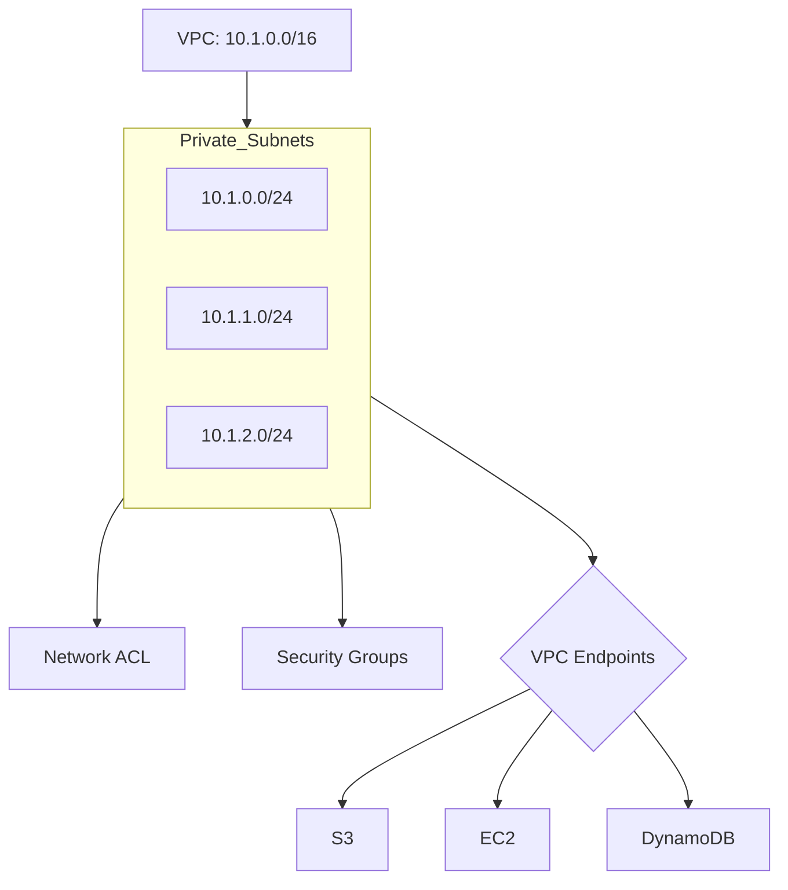
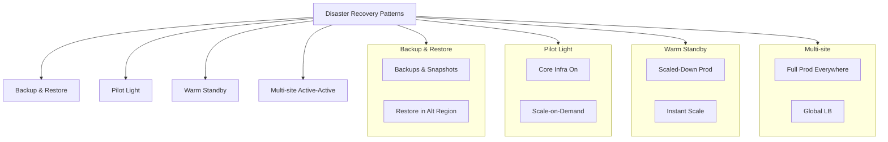
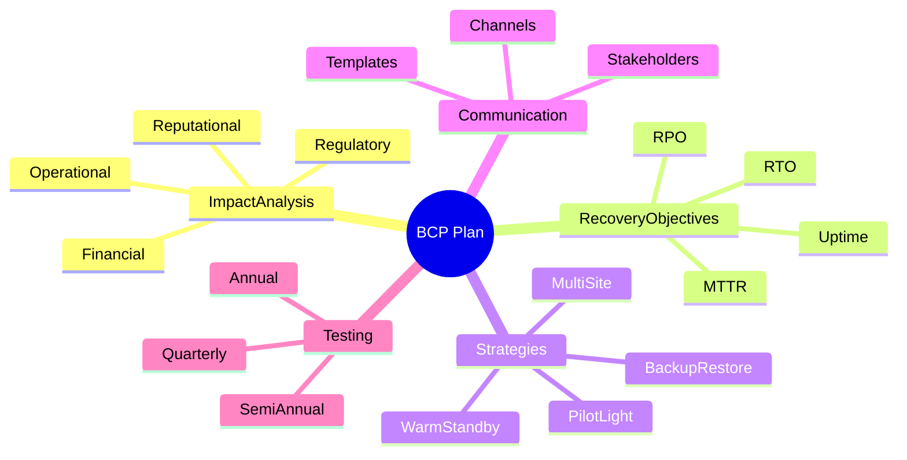
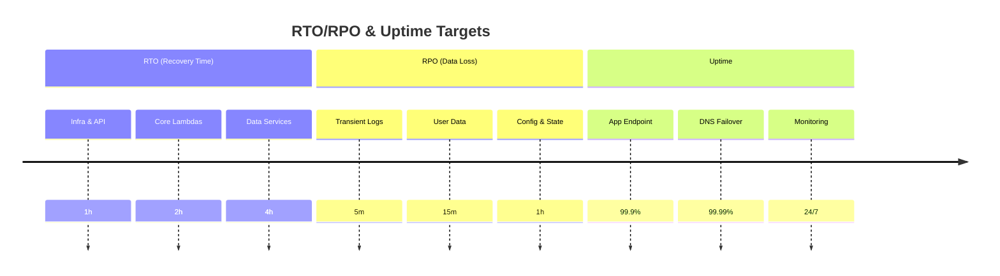
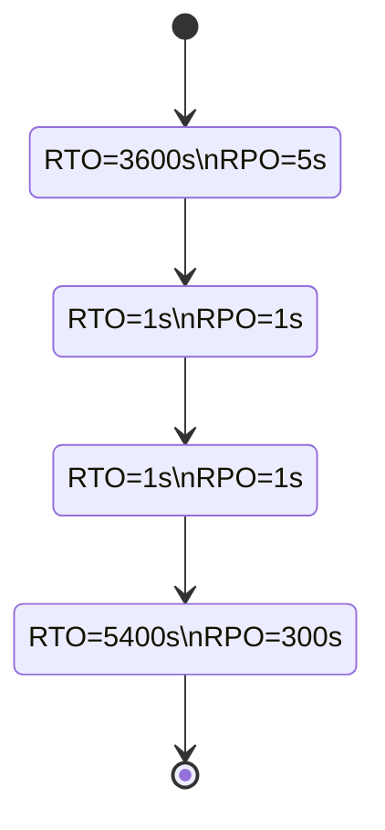

# 🚀 Lambda in Private VPC

[](LICENSE.md)  
[](https://securityscorecards.dev/viewer/?uri=github.com/Hack23/lambda-in-private-vpc)  
[](https://github.com/Hack23/lambda-in-private-vpc/actions/workflows/main.yml)  
[](https://github.com/Hack23/lambda-in-private-vpc/actions/workflows/scorecard.yml)

> **Description:** Run AWS Lambda in private subnets across Ireland and Frankfurt, with multi‑region high availability, RTO/RPO enforcement, chaos testing, DNS failover, and WAF protection.

---

## 📋 Table of Contents

- [🧠 Project Mindmap](#-project-mindmap)  
- [📐 Architecture](#-architecture)  
- [🔗 Network Topology](#-network-topology)  
- [🚦 CI/CD Workflow](#-ci-cd-workflow)  
- [🚨 Disaster Recovery Strategies](#-disaster-recovery-strategies)  
- [🔒 Business Continuity Plan](#-business-continuity-plan)  
- [🛡️ Resilience Hub Policy](#️-resilience-hub-policy)  
- [📦 CloudFormation Templates](#-cloudformation-templates)  
- [🛠️ Tech Stack](#️-tech-stack)  
- [📖 Runbooks](#-runbooks)  
- [🔗 References](#-references)  
- [📄 License](#-license)

---

## 🧠 Project Mindmap



---

## 📐 Architecture

```mermaid
flowchart LR
  subgraph IR [Ireland (eu-west-1)]
    V1[VPC 10.1.0.0/16]
    S1[Subnets A/B/C]
    EP1[Endpoints: S3/EC2/DDB]
    L1[Lambdas]
    G1[API Gateway]
  end
  subgraph FR [Frankfurt (eu-central-1)]
    V2[VPC 10.5.0.0/16]
    S2[Subnets A/B/C]
    EP2[Endpoints: S3/EC2/DDB]
    L2[Lambdas]
    G2[API Gateway]
  end
  V1 --> S1 --> L1 --> EP1
  S1 --> G1
  V2 --> S2 --> L2 --> EP2
  S2 --> G2
  G1 -. Failover .-> DNS[Route 53]
  G2 -. Failover .-> DNS
  classDef region fill:#e0f7fa,stroke:#006064;
  class IR,FR region
```

---

## 🔗 Network Topology



---

## 🚦 CI/CD Workflow

```mermaid
flowchart TD
  A[Dispatch/Push] --> B{Lint & Scan}
  B --> C[cfn-lint]
  B --> D[cfn-nag]
  B --> E[Checkov]
  B --> F[StandardLint]
  B --> G[Scorecard]
  G --> H[ZAP API Scan]
  H --> I[Configure AWS creds (eu-west-1)]
  I --> J[Deploy Core → Ireland]
  J --> K[Collect Outputs]
  K --> L[Configure AWS creds (eu-central-1)]
  L --> M[Deploy Core → Frankfurt]
  M --> N[Aux Stacks → Route 53/DR/ResHub]
  N --> O[Tag & Release]
```

---

## 🚨 Disaster Recovery Strategies



---

## 🔒 Business Continuity Plan





---

## 🛡️ Resilience Hub Policy



---

## 📦 CloudFormation Templates

- **template.yml** – VPC, subnets, endpoints, Lambdas, API, DynamoDB  
- **route53.yml** – Route 53 weighted/failover records  
- **app.yml** – AWS Resilience Hub App & Policy  
- **disaster-recovery.yml** – AWS FIS experiments  
- **waf.yml** – AWS WAFv2 WebACL  

---

## 🛠️ Tech Stack

- AWS CloudFormation  
- AWS Lambda (Node.js 20.x)  
- Amazon API Gateway (Regional)  
- DynamoDB Global Tables  
- VPC Endpoints & Security  
- AWS Resilience Hub & FIS  
- AWS WAFv2 & IAM  
- GitHub Actions, cfn-lint, cfn-nag, Checkov, ZAP, Scorecard  

Details: [techstack.md](techstack.md)

---

## 📖 Runbooks

- **DynamoDB** – AWS Systems Manager  
- **Lambda** – AWS Systems Manager  
- **App Runner** – AWS App Runner  
- **IAM** – AWS IAM Automation  

---

## 🔗 References

- AWS Resilience Hub: https://docs.aws.amazon.com/resilience-hub/latest/userguide/  
- DR I: https://aws.amazon.com/blogs/architecture/disaster-recovery-dr-architecture-on-aws-part-i-strategies-for-recovery-in-the-cloud/  
- DR IV: https://aws.amazon.com/blogs/architecture/disaster-recovery-dr-architecture-on-aws-part-iv-multi-site-active-active/  
- AWS SLA: https://aws.amazon.com/legal/service-level-agreements/  

---

## 📄 License

Apache License 2.0 – see [LICENSE.md](LICENSE.md)
