# 🚀 Lambda in Private VPC

  
  
  

> **Enterprise-grade multi‑region active/active architecture** with automated failover, comprehensive disaster recovery, and strict RTO/RPO enforcement for mission-critical applications.

## 📋 Table of Contents

- [🧠 Project Overview](#-project-overview)
- [📐 Architecture](#-architecture)
- [🔗 Network Topology](#-network-topology)
- [🚦 CI/CD Pipeline](#-cicd-pipeline)
- [🚨 Disaster Recovery Framework](#-disaster-recovery-framework)
- [⏱️ Business Continuity Planning](#️-business-continuity-planning)
- [🔒 Security & Compliance](#-security--compliance)
- [📦 Infrastructure as Code](#-infrastructure-as-code)
- [🛠️ Tech Stack](#️-tech-stack)
- [📖 Runbooks](#-runbooks)
- [🔗 References](#-references)
- [📄 License](#-license)

## 🧠 Project Overview

This project implements a highly resilient, secure serverless architecture using AWS Lambda in private VPCs across multiple regions. It's designed for enterprise-grade applications requiring stringent security, high availability, and disaster recovery capabilities.

## 📐 Architecture

The architecture implements a multi-region active/active design with isolated private VPCs, comprehensive security controls, and automated failover capabilities.

### Key Architecture Components

- **Multi-Region Deployment**: Active/active setup in Ireland (eu-west-1) and Frankfurt (eu-central-1)
- **VPC Isolation**: Private subnets with no internet access for enhanced security
- **VPC Endpoints**: Secure AWS service access without internet exposure
- **Global Data Replication**: DynamoDB global tables with multi-region consistency
- **Intelligent Routing**: Route 53 health checks with automated failover
- **Identity & Access**: Fine-grained IAM roles following least privilege principle
- **Application Protection**: WAFv2 rules to protect API endpoints
- **Comprehensive Monitoring**: CloudWatch, X-Ray, and custom health checks

## 🔗 Network Topology

Each region implements a secure network topology with private subnets, strict network controls, and comprehensive logging.

### Network Security Features

| Feature | Implementation | Purpose |
|---------|---------------|---------|
| **Private Subnets** | 3 AZs per region | Isolate compute resources from internet |
| **Security Groups** | Stateful, fine-grained | Control traffic at instance level |
| **Network ACLs** | Stateless, subnet-level | Additional layer of network security |
| **VPC Endpoints** | Gateway and Interface | Secure AWS service access |
| **Flow Logs** | VPC, subnet, and ENI levels | Network traffic visibility and auditing |
| **Transit Encryption** | TLS for all traffic | Data protection in transit |

## 🚦 CI/CD Pipeline

The project implements a comprehensive CI/CD pipeline with security scanning, multi-region deployment, and automated verification.

### Pipeline Features

- **Security-First Approach**: Multiple security scanning tools run before deployment
- **Infrastructure Validation**: Templates are validated before deployment
- **Multi-Region Coordination**: Sequential deployment to ensure proper resource creation
- **Output Management**: Cross-region resource information is shared between deployments
- **Automated Release**: Successful deployments trigger release creation with changelogs
- **Rollback Capability**: Failed deployments automatically roll back to previous state

## 🚨 Disaster Recovery Framework

The project implements multiple disaster recovery strategies to achieve resilience against various failure scenarios.

```mermaid
flowchart TB
    DR["Disaster Recovery Strategies"] --> BR["Backup & Restore"]
    DR --> PL["Pilot Light"]
    DR --> WS["Warm Standby"]
    DR --> MS["Multi-site Active/Active"]
    
    subgraph "Recovery Capability Evolution"
        BR --> |"Evolve to"| PL
        PL --> |"Evolve to"| WS
        WS --> |"Evolve to"| MS
    end
    
    subgraph "Recovery Metrics"
        BR --- BRMetrics["RTO: Hours/Days<br>RPO: Hours<br>Cost: Low"]
        PL --- PLMetrics["RTO: Hours<br>RPO: Minutes<br>Cost: Low-Medium"]
        WS --- WSMetrics["RTO: Minutes<br>RPO: Minutes<br>Cost: Medium-High"]
        MS --- MSMetrics["RTO: Near-zero<br>RPO: Near-zero<br>Cost: High"]
    end
    
    subgraph "Implementation"
        BR --- BRImpl["• Regular backups<br>• Restore procedures<br>• Recovery testing"]
        PL --- PLImpl["• Core infra always running<br>• Scaled down resources<br>• Rapid scale-up capacity"]
        WS --- WSImpl["• Fully functional standby<br>• Reduced capacity<br>• Auto-scaling ready"]
        MS --- MSImpl["• Multiple full deployments<br>• All regions active<br>• Load balancing across regions"]
    end
    
    classDef strategy fill:#e8f5e9,stroke:#2e7d32,stroke-width:2px;
    classDef metrics fill:#e3f2fd,stroke:#1565c0,stroke-width:2px;
    classDef implementation fill:#fff8e1,stroke:#ff8f00,stroke-width:2px;
    
    class DR,BR,PL,WS,MS strategy;
    class BRMetrics,PLMetrics,WSMetrics,MSMetrics metrics;
    class BRImpl,PLImpl,WSImpl,MSImpl implementation;
```

### DR Strategy Comparison

| Strategy | Recovery Time | Data Loss | Cost | Implementation |
|----------|---------------|-----------|------|---------------|
| **Backup & Restore** | Hours/Days | Hours | $ | Backups with documented restore procedures |
| **Pilot Light** | Hours | Minutes | $$ | Core infrastructure running with rapid scale-up |
| **Warm Standby** | Minutes | Minutes | $$$ | Scaled-down but functional standby environment |
| **Multi-site Active/Active** | Near-zero | Near-zero | $$$$ | Full production deployment in multiple regions |

This project implements the **Multi-site Active/Active** approach for maximum resilience and minimal recovery time.

## ⏱️ Business Continuity Planning

Business continuity is managed through comprehensive impact analysis, recovery objectives, and compliance documentation.

### Business Impact Analysis

| Impact Category | Description | Mitigation Strategy |
|-----------------|-------------|---------------------|
| **Financial Impact** | Revenue loss during outages | Multi-region active/active to minimize downtime |
| **Operational Impact** | Business process disruption | Automated failover for service continuity |
| **Reputational Impact** | Customer trust erosion | Transparent monitoring and communication |
| **Regulatory Impact** | Compliance violations | Comprehensive logging and audit trails |

### Recovery Objectives

## 🔒 Security & Compliance

The project implements comprehensive security controls and compliance mechanisms.

### Compliance Framework Mapping

| Framework | Relevant Controls | Implementation |
|-----------|-------------------|----------------|
| **NIST SP 800-53 Rev. 5** | CP-2, CP-7, CP-9, CP-10, CP-4(2) | Multi-region deployment, automated recovery, regular testing |
| **NIST CSF 2.0** | RC.RP, RC.RP-4, PR.DS-9, ID.BE-5 | Recovery processes, RPO/RTO targets, backup protection, resilience requirements |
| **ISO 27001:2022** | A.17.1.x, A.17.2.1, A.12.3.1 | Continuity planning, availability management, information backup |
| **AWS Well-Architected** | REL01-09, SEC01-10 | Resilient architecture, security at all layers |

### Resilience Hub Policy

## 📦 Infrastructure as Code

The project is defined entirely as Infrastructure as Code using AWS CloudFormation.

### CloudFormation Templates

| Template | Purpose | Key Resources |
|----------|---------|--------------|
| **template.yml** | Core infrastructure | VPC, Subnets, Lambda, API Gateway, DynamoDB |
| **route53.yml** | DNS configuration | Route 53 health checks, failover records |
| **app.yml** | Resilience configuration | AWS Resilience Hub app and policy definition |
| **disaster-recovery.yml** | DR testing | AWS FIS experiments for DR validation |
| **waf.yml** | Security rules | WAFv2 WebACL and rule sets |

## 🛠️ Tech Stack

The project leverages a modern, cloud-native technology stack:

## 📖 Runbooks

Comprehensive documentation is available for operations and recovery:

| Runbook | Purpose | Implementation |
|---------|---------|----------------|
| **[DynamoDB Runbook](runbooks/dynamodb.md)** | DynamoDB recovery | AWS Systems Manager automation |
| **[Lambda Runbook](runbooks/lambda.md)** | Lambda function recovery | AWS Systems Manager automation |
| **[API Gateway Runbook](runbooks/apigateway.md)** | API Gateway recovery | Recovery procedures |
| **[IAM Runbook](runbooks/iam.md)** | Identity management recovery | IAM automation workflows |

## 🔗 References

- [AWS Resilience Hub Documentation](https://docs.aws.amazon.com/resilience-hub/latest/userguide/)
- [Disaster Recovery on AWS - Part I: Strategies for Recovery in the Cloud](https://aws.amazon.com/blogs/architecture/disaster-recovery-dr-architecture-on-aws-part-i-strategies-for-recovery-in-the-cloud/)
- [Disaster Recovery on AWS - Part IV: Multi-site Active/Active](https://aws.amazon.com/blogs/architecture/disaster-recovery-dr-architecture-on-aws-part-iv-multi-site-active-active/)
- [AWS Service Level Agreements](https://aws.amazon.com/legal/service-level-agreements/)
- [AWS Well-Architected Framework - Reliability Pillar](https://docs.aws.amazon.com/wellarchitected/latest/reliability-pillar/welcome.html)

## 📄 License

This project is licensed under the Apache License 2.0 - see [LICENSE.md](LICENSE.md) for details.
