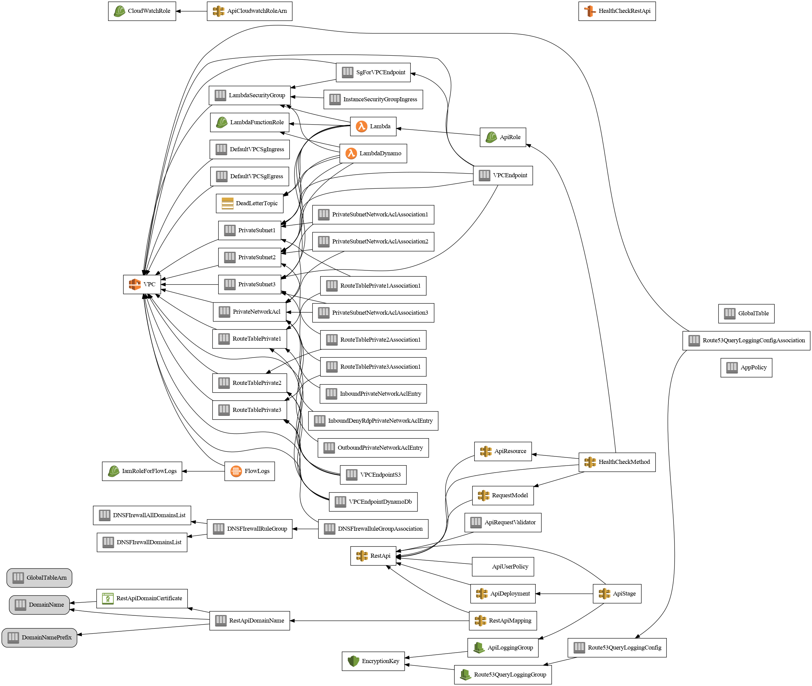

# Lambda in Private VPC

**Status:** Work in Progress

This project shows how to build a highly available system that runs in multiple AWS regions at the same time. It uses AWS Resilience Hub to ensure compliance with policies for Recovery Time Objective (RTO) and Recovery Point Objective (RPO), which help to minimize downtime and data loss in case of failures at the application, availability zone, or region level. This ensures high availability and fault tolerance for your applications.

## Badges

 

## CloudFormation Templates

The project includes several AWS CloudFormation templates that automate the creation and management of the necessary AWS resources:

- `app.yml`: This template sets up an application named "lambda-vpc" with a ResilienceHub ResiliencyPolicy. The application includes AWS Lambda functions, API Gateway Rest APIs, and DynamoDB Global Tables.
- `disaster-recovery.yml`: This template sets up a disaster recovery test using AWS Fault Injection Simulator (FIS). The experiments include denying access to Lambda on API Gateway, deleting a DynamoDB table, and recovering a DynamoDB table from a point-in-time recovery (PITR) or a backup.
- `template.yml`: This template deploys a Lambda function in a private VPC with internet access. The function can access resources in the VPC and make outbound calls to the internet.
- `route53.yml`: This template sets up DNS records in Amazon Route 53 for two API Gateway Rest APIs. The DNS records are configured for failover routing, which means that if one API becomes unavailable, traffic will be routed to the other API.

## Concepts

Learn more about AWS Resilience Hub concepts and understand the key terms and principles involved in building resilient applications [here](https://docs.aws.amazon.com/resilience-hub/latest/userguide/concepts-terms.html).

## About Hack23

- Website: [www.hack23.com](https://www.hack23.com/)
- LinkedIn: [in/jamessorling](https://www.linkedin.com/in/jamessorling)

## Runbooks

- [DynamoDB Runbook](https://docs.aws.amazon.com/systems-manager-automation-runbooks/latest/userguide/automation-ref-ddb.html) - Automates the management of DynamoDB tables and indexes.
- [Lambda Runbook](https://docs.aws.amazon.com/systems-manager-automation-runbooks/latest/userguide/automation-ref-lam.html) - Helps manage Lambda functions, layers, and aliases.
- [Application Bridge Runbook](https://docs.aws.amazon.com/systems-manager-automation-runbooks/latest/userguide/automation-ref-abp.html) - Supports management of Amazon App Runner services and custom domains.
- [IAM Runbook](https://docs.aws.amazon.com/systems-manager-automation-runbooks/latest/userguide/automation-ref-iam.html) - Facilitates IAM user, group, role, and policy management.

## Architecture Diagrams

-  - Depicts the overall infrastructure, including AWS services and components.
-  - Shows the Route 53 configuration for DNS routing and failover.
-  - Displays the setup of the Web Application Firewall for securing your application.
-  - Illustrates the disaster recovery strategy for the application.

## Resilience Hub Screenshots

-  - Overview of the policy settings in AWS Resilience Hub.
-  - The application setup and components in AWS Resilience Hub.
-  - First set of recommendations for improving application resiliency.
-  - Second set of recommendations for enhancing application resiliency.
-  - Regional recommendations

## Tech Stack
Hack23/lambda-in-private-vpc is built on the following main stack:

-  [GitHub Actions](https://github.com/features/actions) – Continuous Integration

Full tech stack [here](/techstack.md)

## Relevant Links

- [Route53 Application Recovery Controller](https://aws.amazon.com/route53/application-recovery-controller/) - Service for managing and testing application recovery across AWS Regions.
- [Route53 Resolver DNS Firewall](https://docs.aws.amazon.com/Route53/latest/DeveloperGuide/resolver-dns-firewall.html) - A managed DNS firewall service to protect applications from malicious DNS activity.
- [SLA MAX Calculator](https://github.com/mikaelvesavuori/slamax) and [Cloud SLA](https://github.com/mikaelvesavuori/cloud-sla) - Tools for calculating and comparing cloud service SLAs.

For more information on AWS service level agreements, visit the [AWS SLA page](https://aws.amazon.com/legal/service-level-agreements/).

## Additional Documentation

- [CHANGELOG.md](CHANGELOG.md)
- [CODE_OF_CONDUCT.md](CODE_OF_CONDUCT.md)
- [CONTRIBUTING.md](CONTRIBUTING.md)
- [LICENSE.md](LICENSE.md)
- [SECURITY.md](SECURITY.md)
- [AlarmRecommendation-apigateway/alarm/AlarmRecommendation-apigateway-Alarm-172017021075-eu-west-1.json](AlarmRecommendation-apigateway/alarm/AlarmRecommendation-apigateway-Alarm-172017021075-eu-west-1.json)
- [AlarmRecommendation-apigateway/alarm/AlarmRecommendation-apigateway-Alarm-172017021075-eu-west-2.json](AlarmRecommendation-apigateway/alarm/AlarmRecommendation-apigateway-Alarm-172017021075-eu-west-2.json)
- [AlarmRecommendation-apigateway/manifest.json](AlarmRecommendation-apigateway/manifest.json)
- [AlarmRecommendation-apigateway/README.md](AlarmRecommendation-apigateway/README.md)
- [SopRecommendation-apigateway/sop/SopRecommendation-apigateway-Sop-172017021075-eu-west-1.json](SopRecommendation-apigateway/sop/SopRecommendation-apigateway-Sop-172017021075-eu-west-1.json)
- [SopRecommendation-apigateway/manifest.json](SopRecommendation-apigateway/manifest.json)
- [SopRecommendation-apigateway/README.md](SopRecommendation-apigateway/README.md)

## License
This project is licensed under the Apache License 2.0.
