# 🚀 Lambda in Private VPC

[](LICENSE.md)  
[](https://securityscorecards.dev/viewer/?uri=github.com/Hack23/lambda-in-private-vpc)  
[](https://github.com/Hack23/lambda-in-private-vpc/actions/workflows/main.yml)  
[](https://github.com/Hack23/lambda-in-private-vpc/actions/workflows/scorecard.yml)

> **Enterprise-grade multi-region active/active architecture** with near-zero recovery time, comprehensive DNS failover, and AWS Resilience Hub policy compliance for mission-critical applications.

## 📋 Table of Contents

- [🌟 Project Overview](#-project-overview)
- [🏗️ Architecture Design](#️-architecture-design)
- [🔐 Security & Network Controls](#-security--network-controls)
- [⚡ Resilience Framework](#-resilience-framework)
- [🧪 Chaos Engineering](#-chaos-engineering)
- [🔄 CI/CD Automation](#-cicd-automation)
- [🔧 Infrastructure as Code](#-infrastructure-as-code)
- [📚 Documentation](#-documentation)
- [📄 License](#-license)

## 🌟 Project Overview

This project implements a highly resilient serverless architecture with AWS Lambda functions deployed in private VPCs across multiple AWS regions (Ireland and Frankfurt). It features comprehensive security controls, automated failover mechanisms, and stringent disaster recovery capabilities through AWS Resilience Hub policy enforcement.

```mermaid
mindmap
  root((("Lambda in<br>Private VPC")))
    Infrastructure["🏢 Infrastructure"]:::infra
      ["Multi-Region VPCs"]
      ["Private Subnets"]
      ["VPC Endpoints"]
      ["DNS Firewall"]
      ["Flow Logs"]
    Security["🔒 Security"]:::security
      ["Private DNS"]
      ["WAF Protection"]
      ["Network ACLs"]
      ["IAM Least Privilege"]
      ["KMS Encryption"]
    Resilience["🛡️ Resilience"]:::resilience
      ["Mission-Critical Policy"]
      ["RTO/RPO Enforcement"]
      ["Multi-Region Active/Active"]
      ["Automatic Failover"]
      ["Chaos Engineering Tests"]
    Data["💾 Data Layer"]:::data
      ["DynamoDB Global Tables"]
      ["Cross-Region Replication"]
      ["Point-in-Time Recovery"]
      ["Backup/Restore Automation"]
      ["Dead Letter Queues"]
    Compute["⚙️ Compute & API"]:::compute
      ["Lambda Functions"]
      ["API Gateway"]
      ["Custom Domain"]
      ["Route 53 Failover"]
      ["Health Checks"]
    CI_CD["🔄 CI/CD & Observability"]:::cicd
      ["Security Scanning"]
      ["Automated Deployment"]
      ["CloudWatch Monitoring"]
      ["X-Ray Tracing"]
      ["Alarm Notifications"]

classDef infra fill:#388e3c,color:#ffffff,stroke:#1b5e20,stroke-width:2px
classDef security fill:#d32f2f,color:#ffffff,stroke:#b71c1c,stroke-width:2px
classDef resilience fill:#7b1fa2,color:#ffffff,stroke:#4a148c,stroke-width:2px
classDef data fill:#1976d2,color:#ffffff,stroke:#0d47a1,stroke-width:2px
classDef compute fill:#f57c00,color:#ffffff,stroke:#e65100,stroke-width:2px 
classDef cicd fill:#5d4037,color:#ffffff,stroke:#3e2723,stroke-width:2px
```

### Key Resilience Metrics

- **99.99% Uptime** through multi-region active/active architecture
- **Near-zero RPO** with DynamoDB global tables and cross-region replication
- **Region-level RTO of 1 hour** enforced by AWS Resilience Hub policy
- **Comprehensive security controls** with private VPCs and WAF protection
- **Automated failover** through Route 53 health checks and weighted routing
- **Mission-critical compliance** with industry best practices and standards

## 🏗️ Architecture Design

A true active/active multi-region architecture with isolated private subnets, global data replication, and automated failover systems.

```mermaid
flowchart TB
    subgraph "Multi-Region Active/Active Architecture"
        subgraph "Ireland (eu-west-1)":::ireland
            IR_VPC["VPC 10.1.0.0/16"]
            IR_SUBNETS["Private Subnets (3 AZs)"]
            IR_LAMBDA["Lambda Functions"]
            IR_DYNAMO["DynamoDB Global Table"]
            IR_API["API Gateway"]
            IR_DOMAIN["Custom Domain"]
            IR_DNS["DNS Firewall"]
            IR_EP["VPC Endpoints"]
            
            IR_VPC --> IR_SUBNETS
            IR_SUBNETS --> IR_LAMBDA
            IR_LAMBDA --> IR_DYNAMO
            IR_LAMBDA --> IR_API
            IR_API --> IR_DOMAIN
            IR_VPC --> IR_DNS
            IR_SUBNETS --> IR_EP
        end
        
        subgraph "Frankfurt (eu-central-1)":::frankfurt
            FR_VPC["VPC 10.5.0.0/16"]
            FR_SUBNETS["Private Subnets (3 AZs)"]
            FR_LAMBDA["Lambda Functions"]
            FR_DYNAMO["DynamoDB Global Table"]
            FR_API["API Gateway"]
            FR_DOMAIN["Custom Domain"]
            FR_DNS["DNS Firewall"]
            FR_EP["VPC Endpoints"]
            
            FR_VPC --> FR_SUBNETS
            FR_SUBNETS --> FR_LAMBDA
            FR_LAMBDA --> FR_DYNAMO
            FR_LAMBDA --> FR_API
            FR_API --> FR_DOMAIN
            FR_VPC --> FR_DNS
            FR_SUBNETS --> FR_EP
        end
        
        IR_DOMAIN -.-> R53["Route 53 Weighted/Failover"]:::routing
        FR_DOMAIN -.-> R53
        IR_DYNAMO <--> FR_DYNAMO
        
        WAF["WAF v2"]:::security --> IR_API
        WAF --> FR_API
        
        HC["Health Checks"]:::monitoring --> IR_API
        HC --> FR_API
        HC -.-> R53
        
        REH["AWS Resilience Hub<br>Mission Critical Policy"]:::resilience --> IR_LAMBDA
        REH --> FR_LAMBDA
        REH --> IR_DYNAMO
        REH --> FR_DYNAMO
    end

    classDef ireland fill:#4CAF50,stroke:#2E7D32,stroke-width:3px,color:#ffffff
    classDef frankfurt fill:#2196F3,stroke:#1565C0,stroke-width:3px,color:#ffffff
    classDef security fill:#F44336,stroke:#D32F2F,stroke-width:3px,color:#ffffff
    classDef routing fill:#FF9800,stroke:#F57C00,stroke-width:3px,color:#ffffff
    classDef resilience fill:#9C27B0,stroke:#7B1FA2,stroke-width:3px,color:#ffffff
    classDef monitoring fill:#FFC107,stroke:#FFA000,stroke-width:3px,color:#000000
```

### Key Architecture Components

| Component | Implementation | Purpose |
|-----------|---------------|---------|
| **Private VPC Infrastructure** | Dedicated VPCs in each region (10.1.0.0/16 & 10.5.0.0/16) | Network isolation and security |
| **Multi-AZ Deployment** | 3 subnets across availability zones per region | High availability within each region |
| **VPC Endpoints** | Interface & Gateway endpoints for S3, EC2, DynamoDB | Secure AWS service access without internet exposure |
| **DNS Firewall** | Allow *.amazonaws.com, block all others | Control outbound DNS traffic from VPC |
| **API Gateway** | Regional endpoints with custom domain names | Exposing Lambda functions securely |
| **Lambda Functions** | Node.js 20.x with VPC configuration | Serverless compute in private subnets |
| **Global Tables** | DynamoDB with multi-region replication | Consistent data across regions with near-zero RPO |
| **Route 53 Routing** | Weighted records with health check failover | Intelligent traffic distribution across regions |

## 🔐 Security & Network Controls

```mermaid
graph TD
    subgraph "Comprehensive Security Framework"
        VPC["🏢 VPC Security"]:::vpc
        NW["🔌 Network Controls"]:::network
        IAM["🔑 Identity & Access"]:::iam
        DATA["🔒 Data Protection"]:::data
        APP["🛡️ Application Security"]:::app
        
        VPC --> DNS_FW["DNS Firewall<br>Allow AWS domains only"]
        VPC --> FLOW["Flow Logs<br>Network traffic auditing"]
        VPC --> PDNS["Private DNS<br>Secure name resolution"]
        
        NW --> NACL["Network ACLs<br>Stateless filtering"]
        NW --> SG["Security Groups<br>Stateful filtering"]
        NW --> DENY["Explicit denials<br>Block RDP (3389)"]
        
        IAM --> ROLES["Fine-grained roles<br>Least privilege"]
        IAM --> POLICY["Resource-based policies"]
        IAM --> TEMP["Temporary credentials"]
        
        DATA --> KMS["KMS Encryption<br>Custom keys"]
        DATA --> ENC_SNS["Encrypted SNS topics"]
        DATA --> ENC_LOG["Encrypted log groups"]
        
        APP --> WAF_IP["WAF IP reputation list"]
        APP --> WAF_ANON["WAF Anonymous IP protection"]
        APP --> WAF_CRS["WAF Common Rule Set"]
        APP --> WAF_BAD["WAF Known Bad Inputs"]
        APP --> WAF_OS["WAF OS protection rules"]
    end

    classDef vpc fill:#2E7D32,stroke:#1B5E20,stroke-width:2px,color:#FFFFFF
    classDef network fill:#1565C0,stroke:#0D47A1,stroke-width:2px,color:#FFFFFF  
    classDef iam fill:#D32F2F,stroke:#B71C1C,stroke-width:2px,color:#FFFFFF
    classDef data fill:#7B1FA2,stroke:#4A148C,stroke-width:2px,color:#FFFFFF
    classDef app fill:#F57C00,stroke:#E65100,stroke-width:2px,color:#FFFFFF
```



### Network Security Features

| Security Control | Implementation | Details |
|------------------|----------------|---------|
| **Private VPC Design** | No internet gateways or NAT gateways | Complete isolation from public internet |
| **DNS Firewall Rules** | Two rules (Allow AWS, Block All) | Only permits *.amazonaws.com domains |
| **Custom Network ACLs** | Inbound/outbound rule sets | Blocks RDP (3389), limits outbound to HTTPS (443) |
| **Security Group Rules** | Precise traffic control | Lambda-to-endpoints only, no other traffic |
| **VPC Flow Logs** | Integration with CloudWatch | Network traffic visibility with encrypted storage |
| **WAF Protection** | Six managed rule groups | IP reputation, anonymous IP, common attacks, Linux/Unix protection |
| **KMS Encryption** | Custom key with automatic rotation | Encrypts SNS topics, CloudWatch logs |
| **IAM Least Privilege** | Scoped down permissions | Specific roles and permissions for each component |

## ⚡ Resilience Framework

The AWS Resilience Hub integration enforces strict recovery time objectives (RTO) and recovery point objectives (RPO) through policy compliance and automated assessment.


### Recovery Time & Point Objectives

| Failure Domain | RTO | RPO | Implementation Strategy |
|----------------|-----|-----|------------------------|
| **Regional** | 3600s (1 hour) | 5s | Multi-region active/active with Route 53 failover, Global Tables |
| **Availability Zone** | 1s | 1s | Multi-AZ deployment with automatic failover |
| **Hardware** | 1s | 1s | AWS managed infrastructure redundancy |
| **Software** | 5400s (90 min) | 300s (5 min) | Automated recovery procedures, backup/restore, chaos testing |

## 🧪 Chaos Engineering

The architecture includes comprehensive disaster recovery testing using AWS Fault Injection Service (FIS) to validate resilience capabilities.


### Chaos Test Scenarios

| Test Scenario | Implementation | Success Metrics | Recovery Method |
|---------------|----------------|-----------------|-----------------|
| **API Gateway Lambda Access Denial** | IAM deny policy injection via SSM | Health check recovery time < RTO | Automatic failover to other region |
| **DynamoDB Table Deletion** | Scheduled table deletion via SSM | Table recreation time < RTO | Automated restore from backup or PITR |
| **Point-In-Time Recovery** | SSM automation document execution | Data recovery with RPO validation | Restoration to specified timestamp |
| **Backup Restoration** | SSM automation with backup ARN | Backup validation and integrity check | Full table recovery from backup |
| **Route 53 Health Check Validation** | Health check failure trigger | Weighted routing adjustment < RTO | Automatic traffic redistribution |

## 🔄 CI/CD Automation


### CI/CD Pipeline Features

- **Pre-Commit Security Validation**: Multiple scanning tools analyze infrastructure templates
- **Sequential Multi-Region Deployment**: Ireland (primary) followed by Frankfurt (secondary)
- **Cross-Region Resource Integration**: Output collection and sharing between deployments
- **Auxiliary Resource Configuration**: Route 53, WAF, Resilience Hub, and Disaster Recovery
- **Automated Version Management**: Git tagging and release notes generation
- **Rollback Capability**: Automatic reversal on deployment failures

## 🔧 Infrastructure as Code

This project is entirely defined using CloudFormation templates with comprehensive resource definitions for each component.

### Template Structure

| Template | Description | Key Resources |
|----------|-------------|---------------|
| **template.yml** | Core Infrastructure | VPCs, Subnets, Lambda Functions, API Gateway, DynamoDB, DNS Firewall, Security Groups, Network ACLs, Flow Logs, KMS Keys |
| **route53.yml** | DNS Configuration | Weighted A/AAAA Records, Health Check Integration, Failover Configuration, Domain Name Integration |
| **app.yml** | Resilience Hub | Mission Critical Policy Definition, RTO/RPO Targets, Multi-Resource Mapping, Assessment Schedule |
| **disaster-recovery.yml** | DR Testing | FIS Experiments, SSM Automation Documents, IAM Roles & Policies, Recovery Procedures, Health Checks |
| **waf.yml** | Security Rules | WAF WebACL, AWS Managed Rule Groups, API Gateway Association |

### Notable Infrastructure Features

- **DNS Firewall Integration**: Fully configured Route 53 DNS Firewall allowing only AWS domains
- **Private DNS Configuration**: Secure VPC DNS settings with customized resolution
- **Comprehensive Network Controls**: Custom ACLs and security groups with explicit deny rules
- **Health Check System**: Multiple Route 53 health checks for various service components
- **Advanced WAF Protection**: Six AWS managed rule groups including IP reputation and known attacks
- **Global DynamoDB Tables**: Cross-region replication with point-in-time recovery
- **Principle of Least Privilege**: Narrowly scoped IAM roles and permissions for all resources

## 📚 Documentation

### Comprehensive Runbooks

- **DynamoDB Recovery Runbook**: Automated Systems Manager procedures for:
  - Point-in-Time Recovery
  - Backup Restoration
  - Table Recreation
  - Cross-Region Synchronization

- **Lambda Function Recovery Runbook**: Procedures covering:
  - Version Management
  - Provisioned Concurrency Adjustment
  - Memory/Execution Time Optimization
  - Error Handling and Retry Logic

- **API Gateway Recovery Runbook**: Workflow documentation for:
  - Endpoint Restoration
  - Custom Domain Reconfiguration
  - WAF Integration Recovery
  - Route 53 Health Check Adjustments

- **IAM Automation Runbook**: Procedures for:
  - Role and Policy Recovery
  - Permission Boundary Enforcement
  - Trust Relationship Verification
  - Cross-Account Access Management

### Recommended Reference Documentation

- [AWS Resilience Hub Documentation](https://docs.aws.amazon.com/resilience-hub/latest/userguide/)
- [Disaster Recovery on AWS - Multi-site Active/Active](https://aws.amazon.com/blogs/architecture/disaster-recovery-dr-architecture-on-aws-part-iv-multi-site-active-active/)
- [AWS Well-Architected Framework - Reliability Pillar](https://docs.aws.amazon.com/wellarchitected/latest/reliability-pillar/welcome.html)
- [AWS Best Practices for DDoS Resiliency](https://d1.awsstatic.com/whitepapers/Security/DDoS_White_Paper.pdf)
- [Route 53 Application Recovery Controller](https://aws.amazon.com/route53/application-recovery-controller/)

## 📄 License

This project is licensed under the Apache License 2.0 - see [LICENSE.md](LICENSE.md) for details.
