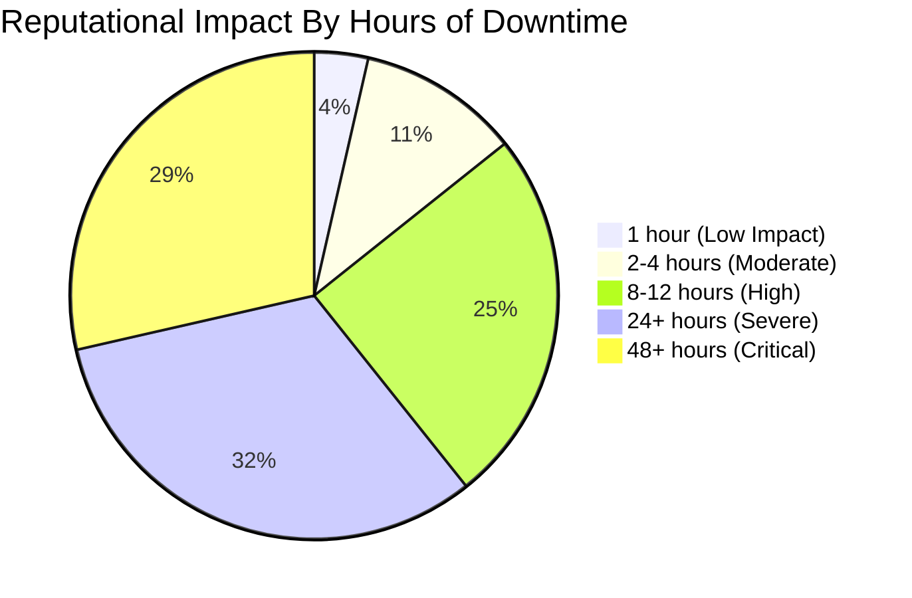
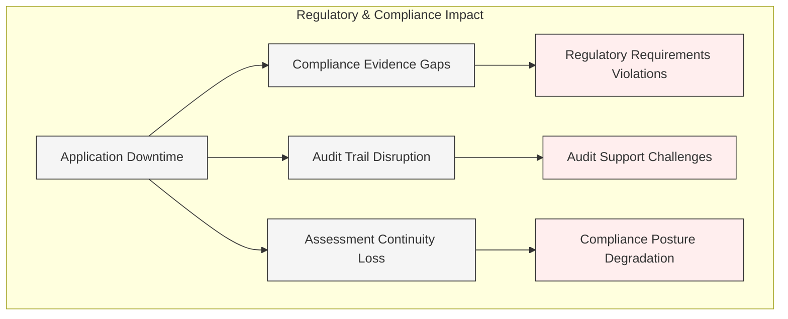

# 🚀 Lambda in Private VPC

  
  
  

> **Enterprise-grade multi-region active/active architecture** with near-zero recovery time, comprehensive DNS failover, and AWS Resilience Hub policy compliance for mission-critical applications.

## 📋 Table of Contents

- [🌟 Project Overview](#-project-overview)
- [🔥 Why High Availability Matters](#-why-high-availability-matters)
- [🏗️ Architecture Design](#️-architecture-design)
- [🔐 Security & Network Controls](#-security--network-controls)
- [⚡ Resilience Framework](#-resilience-framework)
- [🧪 Chaos Engineering](#-chaos-engineering)
- [🔄 CI/CD Automation](#-cicd-automation)
- [🔧 Infrastructure as Code](#-infrastructure-as-code)
- [📚 Documentation](#-documentation)
- [📄 License](#-license)

## 🌟 Project Overview

This project implements a highly resilient serverless architecture with AWS Lambda functions deployed in private VPCs across multiple AWS regions (Ireland and Frankfurt). It features comprehensive security controls, automated failover mechanisms, and stringent disaster recovery capabilities through AWS Resilience Hub policy enforcement.

```mermaid
mindmap
  root((Lambda in Private VPC))
    Infrastructure["🏢 Infrastructure"]
      ["Multi-Region VPCs"]
      ["Private Subnets"]
      ["VPC Endpoints"]
      ["DNS Firewall"]
      ["Flow Logs"]
    Security["🔒 Security"]
      ["Private DNS"]
      ["WAF Protection"]
      ["Network ACLs"]
      ["IAM Least Privilege"]
      ["KMS Encryption"]
    Resilience["🛡️ Resilience"]
      ["Mission-Critical Policy"]
      ["RTO/RPO Enforcement"]
      ["Multi-Region Active/Active"]
      ["Automatic Failover"]
      ["Chaos Engineering Tests"]
    Data["💾 Data Layer"]
      ["DynamoDB Global Tables"]
      ["Cross-Region Replication"]
      ["Point-in-Time Recovery"]
      ["Backup/Restore Automation"]
      ["Dead Letter Queues"]
    Compute["⚙️ Compute & API"]
      ["Lambda Functions"]
      ["API Gateway"]
      ["Custom Domain"]
      ["Route 53 Failover"]
      ["Health Checks"]
    CI_CD["🔄 CI/CD & Observability"]
      ["Security Scanning"]
      ["Automated Deployment"]
      ["CloudWatch Monitoring"]
      ["X-Ray Tracing"]
      ["Alarm Notifications"]
```

### Key Resilience Metrics

- **99.99% Uptime** through multi-region active/active architecture
- **Near-zero RPO** with DynamoDB global tables and cross-region replication
- **Region-level RTO of 1 hour** enforced by AWS Resilience Hub policy
- **Comprehensive security controls** with private VPCs and WAF protection
- **Automated failover** through Route 53 health checks and weighted routing
- **Mission-critical compliance** with industry best practices and standards

## 🔥 Why High Availability Matters

High availability isn't just a technical preference—it's a business imperative with far-reaching implications for modern organizations. Our multi-region active/active architecture directly addresses the following critical concerns:

```mermaid
mindmap
  root((High Availability<br>Impact Areas))
    Financial["💰 Financial Impact"]
      ["Direct Revenue Loss"]
      ["Recovery Costs"]
      ["Regulatory Penalties"]
      ["Operational Inefficiencies"]
    Operational["🏢 Operational Impact"]
      ["Process Disruption"]
      ["Decision Delays"]
      ["Workflow Interruption"]
      ["Productivity Loss"]
    Reputational["🌐 Reputation & Trust"]
      ["Customer Confidence"]
      ["Brand Perception"]
      ["Market Position"]
      ["Partner Relations"]
    Compliance["📜 Regulatory & Compliance"]
      ["Evidence Collection"]
      ["Audit Requirements"]
      ["Control Efficacy"]
      ["Legal Consequences"]
```

### 💰 Financial Impact of Downtime

- **Direct Revenue Impact**: For mission-critical systems, downtime typically costs $1,000-5,000 per minute
- **Recovery Expenses**: Emergency response activities and overtime costs add 30-50% to normal operational costs
- **SLA Violations**: Financial penalties for failing to meet contractual uptime commitments
- **Operational Inefficiency**: Teams resort to slower manual processes during outages, reducing productivity by 40-60%

### 🏢 Operational Consequences

- **Critical Process Disruption**: Security assessment and compliance processes stall during outages
- **Decision Quality Degradation**: Lack of real-time data forces decisions based on incomplete information
- **Cross-system Impacts**: Dependent systems and integration partners experience cascading failures
- **Recovery Time Drain**: IT teams diverted from strategic initiatives to handle recovery operations

### 📊 Reputation and Market Position

- **Trust Erosion**: Customer confidence drops significantly after prolonged or repeated outages
- **Brand Damage**: Social media amplifies service disruptions, creating lasting negative impressions 
- **Competitive Disadvantage**: Competitors with better uptime gain market advantage during outages
- **Partner Relations**: Service disruptions strain relationships with business partners and integrators

### 📜 Compliance Requirements

- **NIST 800-53**: Controls CP-2 (Contingency Plan), CP-7 (Alternate Processing Site), and CP-10 (System Recovery)
- **ISO 27001:2022**: Requirements A.17.1.1 through A.17.2.1 for business continuity and availability management
- **PCI DSS**: Requirements 12.10.1 for incident response capabilities and maintaining service availability
- **GDPR**: Obligations for ensuring "availability and resilience of processing systems and services"
- **Industry SLAs**: Contractual uptime requirements that carry financial and legal penalties when breached

Our multi-region active/active architecture, with its comprehensive resilience framework, addresses all these concerns by providing near-zero RTO/RPO metrics, automatic failover capabilities, and robust compliance documentation that satisfies regulatory requirements across multiple frameworks.

## 🏗️ Architecture Design

A true active/active multi-region architecture with isolated private subnets, global data replication, and automated failover systems.

### Key Architecture Components

| Component | Implementation | Purpose |
|-----------|---------------|---------|
| **Private VPC Infrastructure** | Dedicated VPCs in each region (10.1.0.0/16 & 10.5.0.0/16) | Network isolation and security |
| **Multi-AZ Deployment** | 3 subnets across availability zones per region | High availability within each region |
| **VPC Endpoints** | Interface & Gateway endpoints for S3, EC2, DynamoDB | Secure AWS service access without internet exposure |
| **DNS Firewall** | Allow *.amazonaws.com, block all others | Control outbound DNS traffic from VPC |
| **API Gateway** | Regional endpoints with custom domain names | Exposing Lambda functions securely |
| **Lambda Functions** | Node.js 20.x with VPC configuration | Serverless compute in private subnets |
| **Global Tables** | DynamoDB with multi-region replication | Consistent data across regions with near-zero RPO |
| **Route 53 Routing** | Weighted records with health check failover | Intelligent traffic distribution across regions |

## 🔐 Security & Network Controls

```mermaid
graph TD
    subgraph "Comprehensive Security Framework"
        VPC["🏢 VPC Security"]
        NW["🔌 Network Controls"]
        IAM["🔑 Identity & Access"]
        DATA["🔒 Data Protection"]
        APP["🛡️ Application Security"]
        
        VPC --> DNS_FW["DNS Firewall<br>Allow AWS domains only"]
        VPC --> FLOW["Flow Logs<br>Network traffic auditing"]
        VPC --> PDNS["Private DNS<br>Secure name resolution"]
        
        NW --> NACL["Network ACLs<br>Stateless filtering"]
        NW --> SG["Security Groups<br>Stateful filtering"]
        NW --> DENY["Explicit denials<br>Block RDP (3389)"]
        
        IAM --> ROLES["Fine-grained roles<br>Least privilege"]
        IAM --> POLICY["Resource-based policies"]
        IAM --> TEMP["Temporary credentials"]
        
        DATA --> KMS["KMS Encryption<br>Custom keys"]
        DATA --> ENC_SNS["Encrypted SNS topics"]
        DATA --> ENC_LOG["Encrypted log groups"]
        
        APP --> WAF_IP["WAF IP reputation list"]
        APP --> WAF_ANON["WAF Anonymous IP protection"]
        APP --> WAF_CRS["WAF Common Rule Set"]
        APP --> WAF_BAD["WAF Known Bad Inputs"]
        APP --> WAF_OS["WAF OS protection rules"]
    end

    classDef vpc fill:#2E7D32,stroke:#1B5E20,stroke-width:2px,color:#FFFFFF
    classDef network fill:#1565C0,stroke:#0D47A1,stroke-width:2px,color:#FFFFFF  
    classDef iam fill:#D32F2F,stroke:#B71C1C,stroke-width:2px,color:#FFFFFF
    classDef data fill:#7B1FA2,stroke:#4A148C,stroke-width:2px,color:#FFFFFF
    classDef app fill:#F57C00,stroke:#E65100,stroke-width:2px,color:#FFFFFF
    
    class VPC,DNS_FW,FLOW,PDNS vpc
    class NW,NACL,SG,DENY network
    class IAM,ROLES,POLICY,TEMP iam
    class DATA,KMS,ENC_SNS,ENC_LOG data
    class APP,WAF_IP,WAF_ANON,WAF_CRS,WAF_BAD,WAF_OS app
```

### Network Security Features

| Security Control | Implementation | Details |
|------------------|----------------|---------|
| **Private VPC Design** | No internet gateways or NAT gateways | Complete isolation from public internet |
| **DNS Firewall Rules** | Two rules (Allow AWS, Block All) | Only permits *.amazonaws.com domains |
| **Custom Network ACLs** | Inbound/outbound rule sets | Blocks RDP (3389), limits outbound to HTTPS (443) |
| **Security Group Rules** | Precise traffic control | Lambda-to-endpoints only, no other traffic |
| **VPC Flow Logs** | Integration with CloudWatch | Network traffic visibility with encrypted storage |
| **WAF Protection** | Six managed rule groups | IP reputation, anonymous IP, common attacks, Linux/Unix protection |
| **KMS Encryption** | Custom key with automatic rotation | Encrypts SNS topics, CloudWatch logs |
| **IAM Least Privilege** | Scoped down permissions | Specific roles and permissions for each component |

## ⚡ Resilience Framework

The AWS Resilience Hub integration enforces strict recovery time objectives (RTO) and recovery point objectives (RPO) through policy compliance and automated assessment.

### Recovery Time & Point Objectives

| Failure Domain | RTO | RPO | Implementation Strategy |
|----------------|-----|-----|------------------------|
| **Regional** | 3600s (1 hour) | 5s | Multi-region active/active with Route 53 failover, Global Tables |
| **Availability Zone** | 1s | 1s | Multi-AZ deployment with automatic failover |
| **Hardware** | 1s | 1s | AWS managed infrastructure redundancy |
| **Software** | 5400s (90 min) | 300s (5 min) | Automated recovery procedures, backup/restore, chaos testing |

## 🧪 Chaos Engineering

The architecture includes comprehensive disaster recovery testing using AWS Fault Injection Service (FIS) to validate resilience capabilities.

### Chaos Test Scenarios

| Test Scenario | Implementation | Success Metrics | Recovery Method |
|---------------|----------------|-----------------|-----------------|
| **API Gateway Lambda Access Denial** | IAM deny policy injection via SSM | Health check recovery time < RTO | Automatic failover to other region |
| **DynamoDB Table Deletion** | Scheduled table deletion via SSM | Table recreation time < RTO | Automated restore from backup or PITR |
| **Point-In-Time Recovery** | SSM automation document execution | Data recovery with RPO validation | Restoration to specified timestamp |
| **Backup Restoration** | SSM automation with backup ARN | Backup validation and integrity check | Full table recovery from backup |
| **Route 53 Health Check Validation** | Health check failure trigger | Weighted routing adjustment < RTO | Automatic traffic redistribution |

## 🔄 CI/CD Automation

### CI/CD Pipeline Features

- **Pre-Commit Security Validation**: Multiple scanning tools analyze infrastructure templates
- **Sequential Multi-Region Deployment**: Ireland (primary) followed by Frankfurt (secondary)
- **Cross-Region Resource Integration**: Output collection and sharing between deployments
- **Auxiliary Resource Configuration**: Route 53, WAF, Resilience Hub, and Disaster Recovery
- **Automated Version Management**: Git tagging and release notes generation
- **Rollback Capability**: Automatic reversal on deployment failures

## 🔧 Infrastructure as Code

This project is entirely defined using CloudFormation templates with comprehensive resource definitions for each component.

### Template Structure

| Template | Description | Key Resources |
|----------|-------------|---------------|
| **template.yml** | Core Infrastructure | VPCs, Subnets, Lambda Functions, API Gateway, DynamoDB, DNS Firewall, Security Groups, Network ACLs, Flow Logs, KMS Keys |
| **route53.yml** | DNS Configuration | Weighted A/AAAA Records, Health Check Integration, Failover Configuration, Domain Name Integration |
| **app.yml** | Resilience Hub | Mission Critical Policy Definition, RTO/RPO Targets, Multi-Resource Mapping, Assessment Schedule |
| **disaster-recovery.yml** | DR Testing | FIS Experiments, SSM Automation Documents, IAM Roles & Policies, Recovery Procedures, Health Checks |
| **waf.yml** | Security Rules | WAF WebACL, AWS Managed Rule Groups, API Gateway Association |

### Notable Infrastructure Features

- **DNS Firewall Integration**: Fully configured Route 53 DNS Firewall allowing only AWS domains
- **Private DNS Configuration**: Secure VPC DNS settings with customized resolution
- **Comprehensive Network Controls**: Custom ACLs and security groups with explicit deny rules
- **Health Check System**: Multiple Route 53 health checks for various service components
- **Advanced WAF Protection**: Six AWS managed rule groups including IP reputation and known attacks
- **Global DynamoDB Tables**: Cross-region replication with point-in-time recovery
- **Principle of Least Privilege**: Narrowly scoped IAM roles and permissions for all resources

## 📚 Documentation

### Comprehensive Runbooks

- **DynamoDB Recovery Runbook**: Automated Systems Manager procedures for:
  - Point-in-Time Recovery
  - Backup Restoration
  - Table Recreation
  - Cross-Region Synchronization

- **Lambda Function Recovery Runbook**: Procedures covering:
  - Version Management
  - Provisioned Concurrency Adjustment
  - Memory/Execution Time Optimization
  - Error Handling and Retry Logic

- **API Gateway Recovery Runbook**: Workflow documentation for:
  - Endpoint Restoration
  - Custom Domain Reconfiguration
  - WAF Integration Recovery
  - Route 53 Health Check Adjustments

- **IAM Automation Runbook**: Procedures for:
  - Role and Policy Recovery
  - Permission Boundary Enforcement
  - Trust Relationship Verification
  - Cross-Account Access Management

### Recommended Reference Documentation

- [AWS Resilience Hub Documentation](https://docs.aws.amazon.com/resilience-hub/latest/userguide/)
- [Disaster Recovery on AWS - Multi-site Active/Active](https://aws.amazon.com/blogs/architecture/disaster-recovery-dr-architecture-on-aws-part-iv-multi-site-active-active/)
- [AWS Well-Architected Framework - Reliability Pillar](https://docs.aws.amazon.com/wellarchitected/latest/reliability-pillar/welcome.html)
- [AWS Best Practices for DDoS Resiliency](https://d1.awsstatic.com/whitepapers/Security/DDoS_White_Paper.pdf)
- [Route 53 Application Recovery Controller](https://aws.amazon.com/route53/application-recovery-controller/)

## ☁️ Lambda in Private VPC Project Classification

### 🎯 Project Classification

### 🔒 Security Classification

### ⏱️ Business Continuity
[-orange?style=for-the-badge&logo=clock&logoColor=white)](https://github.com/Hack23/ISMS-PUBLIC/blob/main/CLASSIFICATION.md#rto-classifications)
[-orange?style=for-the-badge&logo=database&logoColor=white)](https://github.com/Hack23/ISMS-PUBLIC/blob/main/CLASSIFICATION.md#rpo-classifications)

### 💰 Business Impact Analysis Matrix

| Impact Category | Financial | Operational | Reputational | Regulatory |
|-----------------|-----------|-------------|--------------|------------|
| **🔒 Confidentiality** |  |  |  |  |
| **✅ Integrity** |  |  |  |  |
| **⏱️ Availability** |  |  |  |  |

### 🛡️ Security Investment Returns

### 🎯 Competitive Differentiation

### 📈 Porter's Five Forces Strategic Impact

## 📄 License

This project is licensed under the Apache License 2.0 - see [LICENSE.md](LICENSE.md) for details.

---
*Last updated: 2025-04-16*
